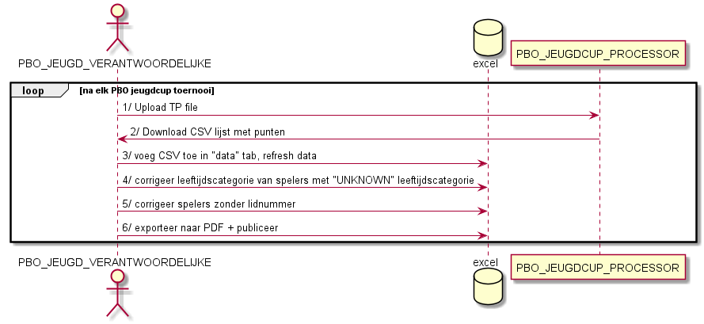
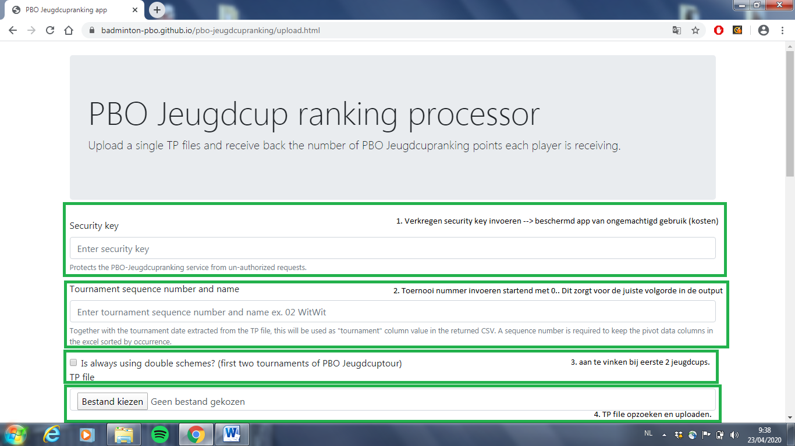
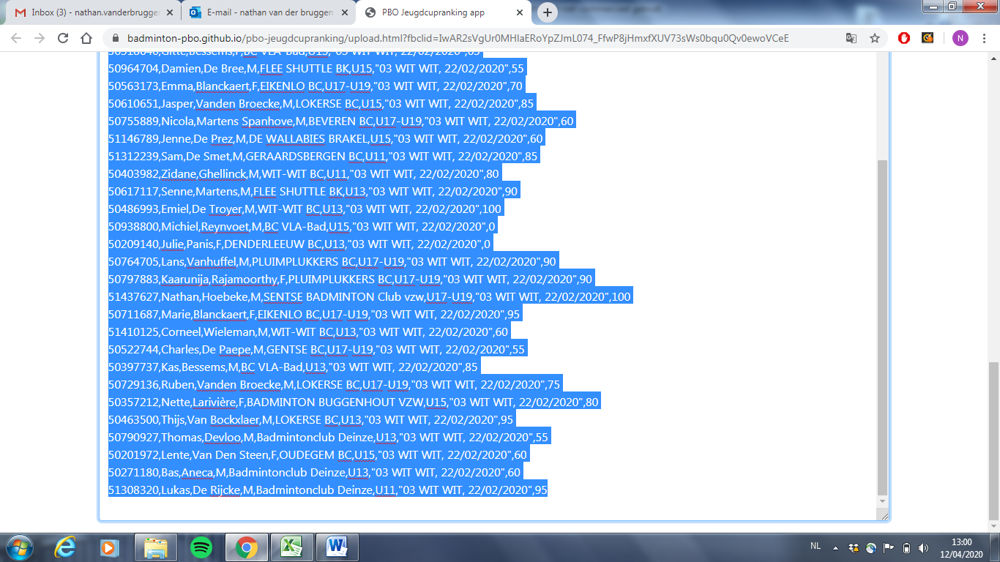
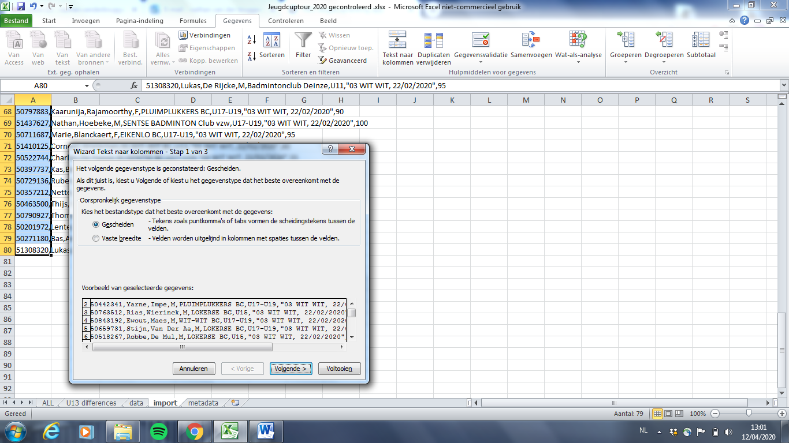
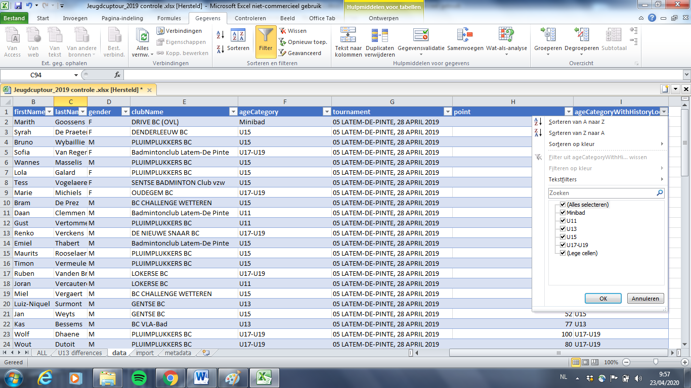

# Gebruik van PBO jeugdcupranking processor om de PBO jeugdcupranking te onderhouden na elk toernooi

De ranking van de PBO jeugdcup wordt in een __excel__ bijgehouden door de __PBO Jeugd verantwoordelijke__.
Na elke jeugdcup toernooi moet deze ranking bijgewerkt worden op basis van de toernooi uitslagen. 
Via de __PBO jeugcupranking processor__ kan de TP-file van één toernooi verwerkt wordt tot een lijst van punten per speler voor dit toernooi.
Deze lijst moet dan via enkele manuele stappen in de __excel__ worden ingebracht

##1. Upload TP file

Post TP file via [upload pagina](https://badminton-pbo.github.io/pbo-jeugdcupranking/upload.html)

De security code moet je wel bij hand hebben.

##2. Download CSV 

Kopieer CSV output in klembord

##3. Voeg CSV toe aan excel en refresh data
Plak in tab `import`

Indien alle data in 1 cel staat moet een _tekst naar kolommen_ operatie worden toegepast:

* selecteer data
* klik op “tekst naar kolommen”  indelen op basis van “komma teken”.

* kopieer import data over naar `data` tab 

TODO....

* Telkens wanneer je gegevens aanpast in de data-tab moet je Pivot tabellen refreshen via `Data > Refresh All` of `alles vernieuwen`

##4. Corrigeer leeftijdscategorie
Wanneer er tijdens de jeugdcup leeftijden werden samengevoegd tot 1 categorie kan de correcte leeftijdscategorie niet meer bepaald worden obv. de TP file
Controleer daarom of er `UNKNOWN` spelers zijn. Bij deze werd geen leeftijd categorie gevonden en moet je manueel na gaan wat de leeftijd is. 
Normaal zorgt de laatste  kolom voor een “search in history” en kijkt of de speler eerder actief was in een categorie en neemt deze over.

##5. Corrigeer lidnummers
Spelers zonder lidnummer (manueel toegevoegd door de toernooiorganisatie) krijgen een fictief lidnummer startend met “99…” deze moet je in theorie ook manueel opvolgen maar kunnen ook tijdelijk met het 99 cijfer in de ranking verschijnen.
